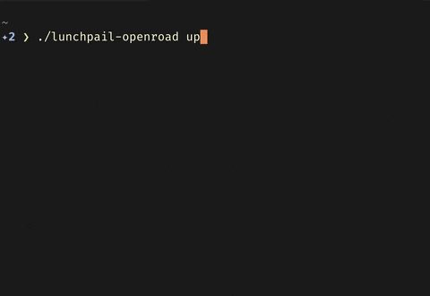
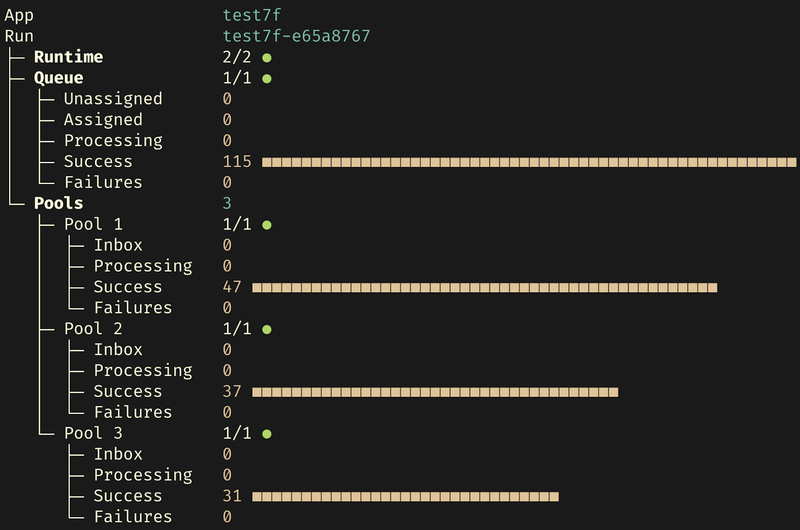
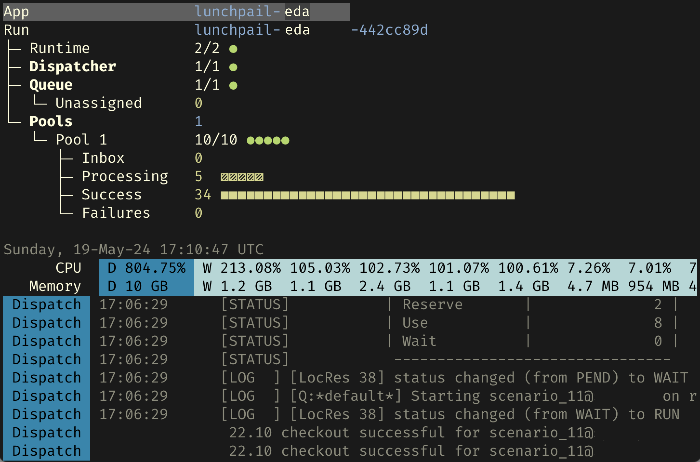

<image align="right" alt="Lunchpail icon" src="docs/lunchpail.png" title="Lunchpail" width="64">

# Lunchpail

Lunchpail compiles your job code into an all-in-one executable. Others
download that binary, and `up` it to run your code in the Cloud or an
existing Kubernetes cluster.

> [!IMPORTANT]
> Bear with us as we finish up the initial polishing passes. Please chip in if you can!

<table>
    <tr>
        <td> <a href="docs/demos/#openroad-demo"><tt>lunchpail-openroad up</tt></a></td>
        <td> <a href="docs/demos/#lunchpail-demo"><tt>lunchpail-demo up</tt></a></td>
        <td> Commercial application</td>
    </tr>
</table>

## Getting Started

### Lunchpail Architecture

Lunchpail is a compiler that generates all-in-one "black box" binaries
that know how to start a run, provision Cloud resources, auto-correct
for load imbalances and node failures, and to monitor and visualize
runs. [Learn more](./docs/architecture/README.md)

### Pre-built Demos

We have used Lunchpail to build binaries of several demo
applications. [Try a demo](./docs/demos/README.md)

### Create Your Own Downloadable Binaries

Point to your source code, and Lunchpail can compile a set of platform
binaries that shrink-wrap how to run your jobs.  [Learn
more](./docs/build/README.md)

### Contribute

Lunchpail is open source and contributions are welcome. Want to create
a backend for your Cloud? Want to optimize the runtime?  [Learn
more](./docs/contribute/README.md)
