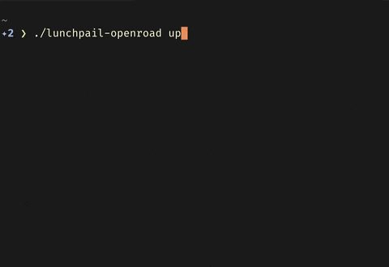
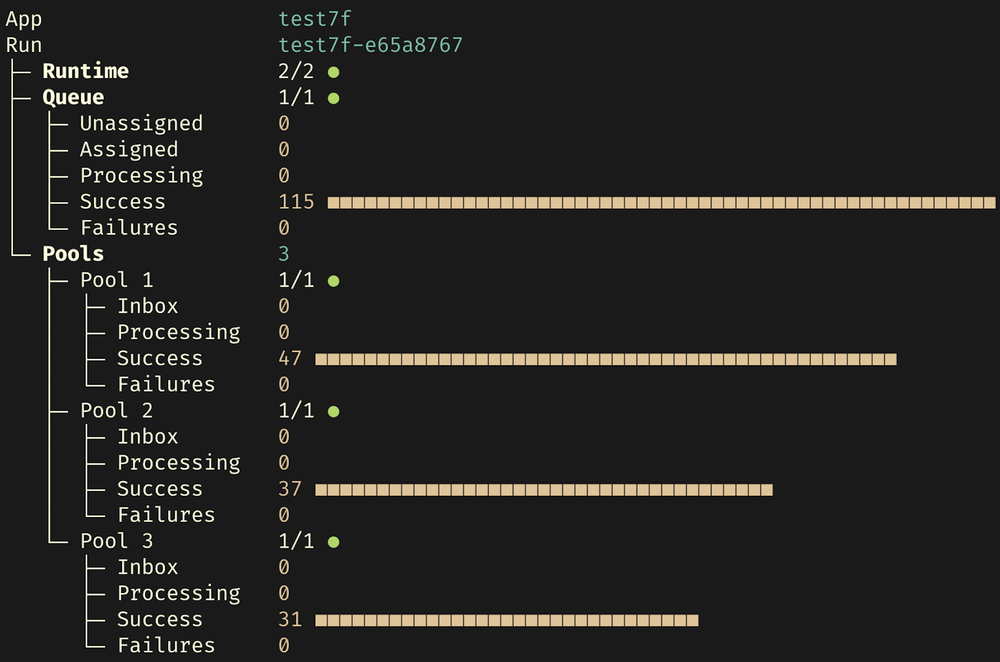
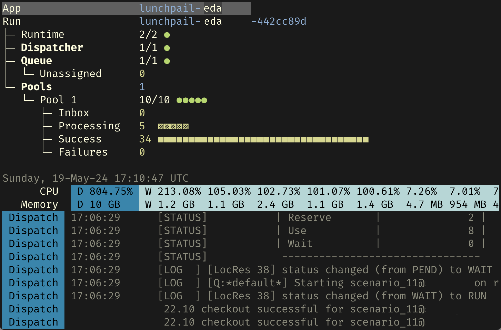

<image align="right" alt="Lunchpail icon" src="docs/lunchpail.png" title="Lunchpail" width="64">

# Lunchpail

Lunchpail compiles your job code into an all-in-one executable. Others download that binary, and `up` it to run your code in the Cloud or an existing Kubernetes cluster. 

<table>
    <tr>
        <td></td>
        <td></td>
        <td></td>
    </tr>
    <tr>
        <td><a href="docs/demos/#openroad-demo"><tt>lunchpail-openroad up</tt></a></td>
        <td><a href="docs/demos/#lunchpail-demo"><tt>lunchpail-demo up</tt></a></td>
        <td>Commercial app</td>
    </tr>
</table>

## Getting Started

- [Try a demo](./docs/demos/README.md). We have used Lunchpail to build binaries of several demo applications.
- [Build binaries for your application](./docs/build/README.md)
- [Develop Lunchpail itself](./docs/contribute/README.md)

## User Roles

Here are some of the Lunchpail use cases, summarized by user role:

<table>
    <tr>
        <td>
            <strong>Application Owners</strong> shrink-wrap and distribute code as binaries. Lunchpail bundles your code with the logic for deployment, scaling, load balancing, observability, etc.
        </td>
        <td>
            <strong>Platform engineers</strong> can shrink-wrap the variants of base application logic for their team's use cases. These also become distributable binaries.
        </td>
    </tr>
    <tr>
        <td>
            <strong>End users</strong> or <strong>automators</strong> can stitch together the steps of automation, because each step is a black box shrink-wrapped application.
        </td>
        <td>
            <strong>Budgeters</strong> and <strong>managers</strong> can have their developers run the applications in a mode that only queues up work. Separately, one can use the same binary to allocate or reduce resources assigned to each queue, as budget allows.
        </td>
    </tr>
</table>

## And... Welcome!

Lunchpail is a new project. Bear with us, and please chip in if you
can, as we finish up the initial polishing passes. 
