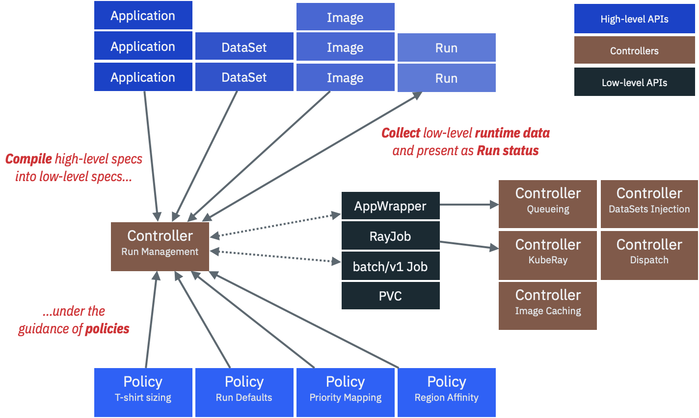

# CodeFlare Platform

The [CodeFlare](https://codeflare.dev) Platform helps users and
operators with running large-scale jobs on a multi-tenant Kubernetes
cluster. It consists of a set of high-level [**resource
types**](#resource-types) managed by a collection of Kubernetes
**controllers** that operate under a defined set of high-level
[**policies**](#policy-types).

The CodeFlare Run Controller acts as a compiler, lowering the
high-level user-facing APIs to a set of lower level constructs which
are in turn [managed by a suite of open source
technologies](#technologies-employed).

<a name="resource-types">

## High-level Resource API

- **Applications**: The Platform allows an application owner to write
  a simple declarative specification. They can be simple, because
  **every application fits into an archetype**: *Ray* versus *Torch*
  versus *WorkFlow* versus *WorkQueue*. The Platform takes care of
  interpreting how to execute instances of these archetypes.  [Example Torch
  Application.yaml](watsonx_ai/charts/applications/templates/examples/torch/lightning.yaml)
- **DataSets**: An application spec may associate one or more input
  data sets with their application specification. The Platform takes
  care of managing all of the Kubernetes details (volumes, mounts, claims,
  etc.) [Example
  DataSet.yaml](https://github.ibm.com/nickm/codeflare-platform/blob/rm/tests/templates/datasets/s3-test.yaml)
- **Jobs/Runs**: An application *user* specs their run by pointing to
  the Application resource they wish to execute, and optionally
  overriding application defaults such as command line
  options. [Example Ray
  Run.yaml](tests/runs/watsonx_ai/ray/qiskit.yaml) **|** [Example
  Torch Run.yaml](tests/runs/watsonx_ai/torch/lightning.yaml)
- [TODO] Images

<a name="policy-types">

## High-level Policy API

- **RunSizeConfiguration**: instances of this kind allow admins to
  define a mapping from tee shirt sizes to physical size constraints
  on the cluster.
  
## Technologies Employed

The CodeFlare Platform brings together a number of popular
technologies, and links them together with some new data types and
controller logic. The existing technologies employed include (in
alphabetical order):

- [Datashim](https://github.com/datashim-io/datashim)
- [Fluentbit](https://fluentbit.io/)
- [KubeRay](https://github.com/ray-project/kuberay)
- [Kubernetes Co-scheduler](https://github.com/kubernetes-sigs/scheduler-plugins)
- [Multi-cluster App Dispatcher](https://github.com/project-codeflare/multi-cluster-app-dispatcher)
- [TorchX](https://pytorch.org/torchx/latest/)

## Getting Started

Architecturally, the CodeFlare Platform is a [Helm
chart](https://helm.sh). Via [Helm
dependencies](https://helm.sh/docs/helm/helm_dependency/), you can
incorporate a custom platform. You may include your own set of
applications, datasets, images, and policies to shape an experience
for your users. It is relatively lightweight, and runs fine in
[Kind](#local-development-using-kind) on most laptops.

To get started with contributing the Platform, see the
[Platform Developer Documentation](docs/development.md).
