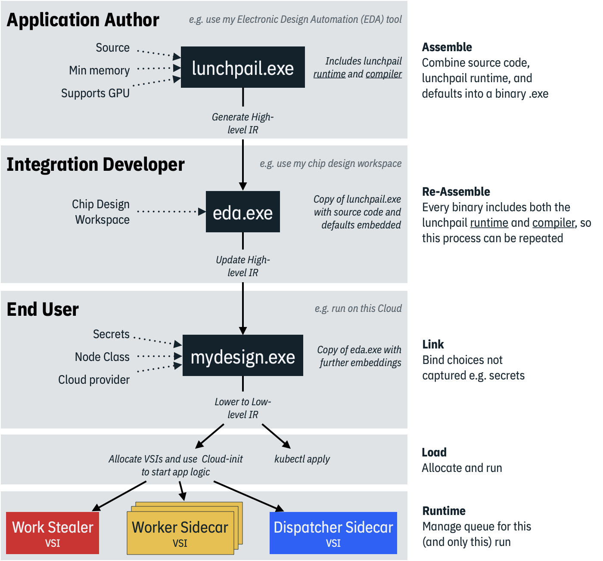
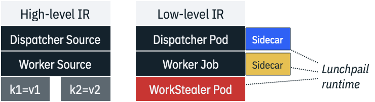
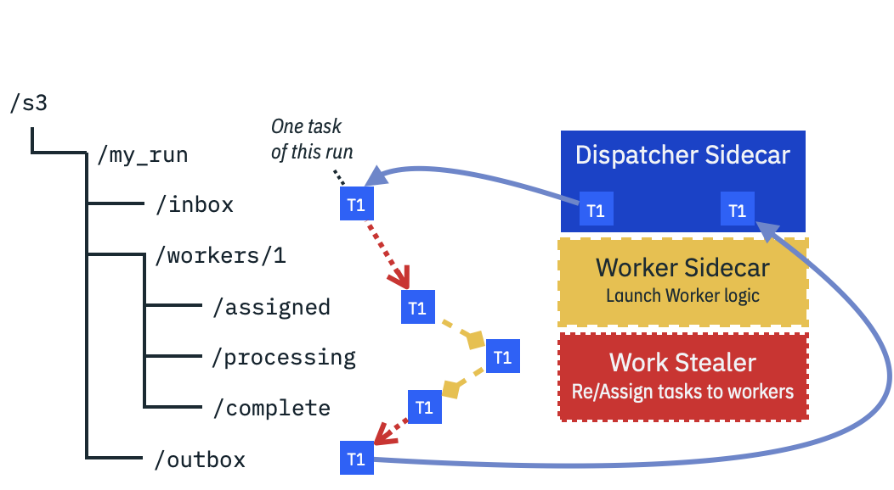

# Lunchpail Architecture

Lunchpail is structured as a
[compiler](https://en.wikipedia.org/wiki/Compiler) which takes
application source code and, through a series of [intermediate
representations](https://en.wikipedia.org/wiki/Intermediate_representation)
(IRs), generates a platform binary. Invoking the binary with `up`
starts a run.

Every compiled Lunchpail binary includes a set of capabilities:

- Every binary **embeds values** such as application source and
configuration parameters. This allows one member of a team to generate
a "black box" binary for others to use.
- Compiled binaries also include **deployment logic** which is used by
`up` to allocate and configure resources needed for that run.
- A lightweight **runtime** that channels data to workers in a way
  that is resilient to failures and load imbalances.
- The **Lunchpail compiler itself** so that new binaries can be
  generated from existing ones, allowing team members to further
  specialize behaviors. For example, a AI/ML team may wish to generate
  one binary per pre-trained model they support. An [electronic design
  automation](https://en.wikipedia.org/wiki/Electronic_design_automation)
  team may wish to generate one binary per chip design they are
  working on.
- A console-based dashboard that helps with tracking the progress and
  health of a run.

#### Application Authors

Shrink-wrap and distribute code as binaries. Lunchpail bundles your code with the logic for deployment, scaling, load balancing, observability, etc.

#### Integration Developers

Shrink-wrap the variants of base application logic for their team's use cases. These also become distributable binaries.

#### End Users and Automators

Stitch together the steps of automation, because each step is a black box shrink-wrapped application.

#### Budgeters and Project Managers

Have your developers run the applications in a mode that only queues up work. Separately, one can use the same binary to allocate or reduce resources assigned to each queue, as budget allows.
