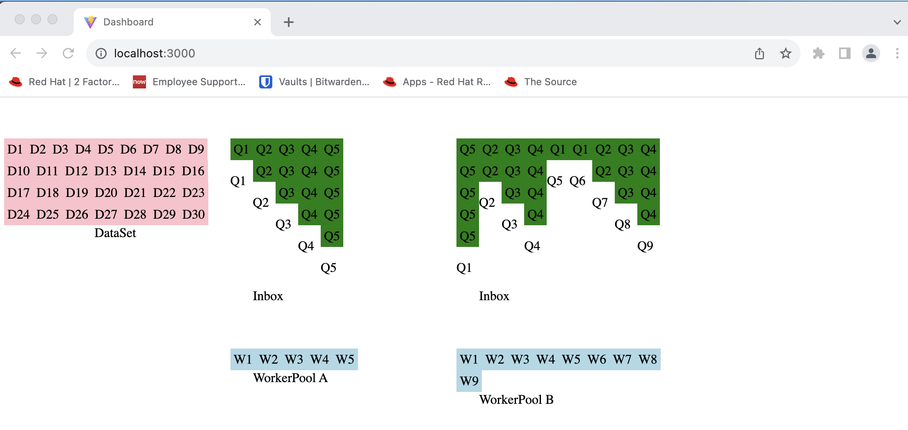

# Dashboard



## Getting Started

Using the [Vite + Express Starter Kit](https://github.com/szymmis/vite-express#-installation--usage), we can see the dashboard via `http://localhost:3000/` (press `q` key to exit).


In a terminal, 
```
cd platform/dashboard/ 
yarn
yarn dev
```

## Directory Structure

`├──`[`src`](./src/) — Application root, components, style, and configurations<br>
`|  ├──`[`client`](./src/client/)<br>
`|  |   ├──`[`components`](./src/client/components)<br>
`|  |   ├──`[`components`](./src/client/components) — Styling sheets <br>
`|  |   ├──`[`App.tsx`](./src/client/App.tsx) — The dashboard, front-end built with [React](https://react.dev/) and [PatternFly](https://www.patternfly.org)<br>
`|  |   ├──`[`main.tsx`](./src/client/main.tsx) — Single-page application (SPA) entry point<br>
`|  |   ├──`[`tsconfig.json`](./src/client/tsconfig.json) — TypeScript configuration<br>
`|  |   ├──`[`vite-env.d.ts`](./src/client/vite-env.d.ts) — Global Vite type declarations<br>
`|  ├──`[`server`](./src/server/)<br>

## Scripts

- `yarn dev` — Launches the app in development mode on [`http://localhost:3000/`](http://localhost:5173/)
- `yarn build` — Compiles and bundles the app for deployment
- `yarn lint` — Validate the code using ESLint
- `yarn tsc` — Validate the code using TypeScript compiler
- `yarn test` — Run unit tests with Vitest, Supertest
- `yarn edge deploy` — Deploys the app to Cloudflare

## How to Update

- `yarn` — Update dependencies
- `yarn set version latest` — Bump Yarn to the latest version
- `yarn upgrade-interactive` — Update Node.js modules (dependencies)
- `yarn dlx @yarnpkg/sdks vscode` — Update TypeScript, ESLint, and Prettier settings in VSCodes